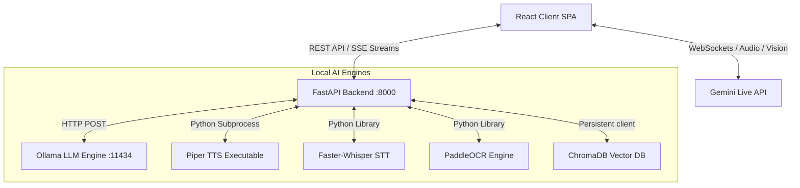

# GyaanSetu AI — Deep-Dive Model Architecture & Response Flow

This document details the system design, components, models, and execution details of the GyaanSetu AI platform. It covers how every model runs, how responses are generated, and how the frontend and backend orchestrate services.

---

## 1. System Architecture Overview

GyaanSetu AI is designed as a hybrid neural education ecosystem combining fully offline, privacy-first local models with optional low-latency cloud integrations (Gemini API).

---

## 2. Local AI Subsystems (`gyaansetu-backend`)

The Python FastAPI backend operates on `http://localhost:8000`. It coordinates the following local models and libraries:

### A. Local LLM Orchestration (Ollama)
* **API Endpoint**: `/tutor/chat` (Streaming SSE) & `/tutor/chat/simple` (Plain JSON)
* **Module Path**: [ollama_service.py](file:///c:/Users/Kaushal%20Dubey/Downloads/Gyaaansetu_AI-main/Gyaaansetu_AI-main/gyaansetu-backend/services/ollama_service.py)
* **Model Task Routing**:
  * **`tutor` / `mistakes`** $\rightarrow$ `llama3.1:8b` (General tutoring and explanations)
  * **`code` / `interview` / `career`** $\rightarrow$ `deepseek-r1` (Deep reasoning, code review, and roadmap generation)
  * **`fast`** $\rightarrow$ `phi3` (Speed-focused answers, health index calculation)
  * **`creative`** $\rightarrow$ `gemma3` (Roleplaying, flashcard generation)
* **Fallback Flow**:
  If the configured model is missing, the backend queries `GET http://localhost:11434/api/tags` and searches for the best available model in this order:
  1. Exact match.
  2. Matching name with a different tag (e.g. `deepseek-r1:latest`).
  3. `llama3.1:8b` (default fallback).
  4. `phi3` (fast fallback).
  5. The first model in the returned tags list.
* **Mode Adaptation**:
  System instructions are customized dynamically depending on the selected study mode:
  * *Explain Like I'm 10*: Simplified analogies, conversational, steps, avoids jargon.
  * *Exam Preparation*: Structured response (Core definition $\rightarrow$ Formulas/Concepts $\rightarrow$ Step-by-step $\rightarrow$ Pitfalls).
  * *Competitive Exam Mode*: Crisp high-yield notes, memory mnemonics, solving algorithms.
  * *Interview Mode*: FAANG star structure, follow-up testing questions.
* **Multi-Language Override**:
  Supports translations to Indian regional languages (*Hindi, Marathi, Gujarati, Tamil, Telugu, Bengali, Kannada, Malayalam, Punjabi*). An override instruction is injected into the system prompt instructing the model to translate and output the entire response in the native language (preserving raw JSON keys if returning structured data).

### B. Offline Speech-to-Text (Faster-Whisper)
* **API Endpoint**: `/tutor/voice`
* **Module Path**: [whisper_service.py](file:///c:/Users/Kaushal%20Dubey/Downloads/Gyaaansetu_AI-main/Gyaaansetu_AI-main/gyaansetu-backend/services/whisper_service.py)
* **Implementation**:
  * Uses the `faster-whisper` library (re-engineered Whisper in C++ using CTranslate2).
  * Default model: `"base"` running on CPU with `compute_type="int8"` (quantized to save RAM/CPU usage).
  * Loaded lazily on the first request to keep server startup fast.
  * Audio bytes from the API are saved into a temporary `.wav` file and decoded with **Voice Activity Detection (VAD)** filtering enabled to drop silent parts.
  * Returns text transcript, language, and probability score.

### C. Local Text-to-Speech (Piper TTS)
* **API Endpoint**: `/tutor/tts`
* **Module Path**: [piper_service.py](file:///c:/Users/Kaushal%20Dubey/Downloads/Gyaaansetu_AI-main/Gyaaansetu_AI-main/gyaansetu-backend/services/piper_service.py)
* **Implementation**:
  * Runs the fast, local `piper` command-line executable.
  * ONNX voices are stored in `PIPER_MODELS_DIR` (`./piper_models`):
    * English: `en_US-lessac-medium`
    * Hindi & Marathi: `hi_IN-sangita-medium`
  * Automatically downloads the voice `.onnx` and `.onnx.json` model files from the web using `python -m piper` if not found in the local folder.
  * Executes a subprocess via `asyncio.create_subprocess_exec`, writing text directly to `stdin` and rendering output to a unique WAV file in `/audio_out`.
  * Returns a static url path (`/audio/tts_<uuid>.wav`) to the client.

### D. Offline OCR (PaddleOCR & pdfplumber)
* **API Endpoint**: `/ocr/solve` & `/ocr/extract-pdf`
* **Module Path**: [ocr_service.py](file:///c:/Users/Kaushal%20Dubey/Downloads/Gyaaansetu_AI-main/Gyaaansetu_AI-main/gyaansetu-backend/services/ocr_service.py)
* **Implementation**:
  * Uses `paddleocr` in CPU mode with angle classification enabled (`use_angle_cls=True`) for reading text from images.
  * For PDFs: Uses `pdfplumber` to extract vector text. If a page has no text content (scanned image), the system renders the page as a PNG image in memory and fallbacks to running the PaddleOCR engine on it.

### E. Retrieval-Augmented Generation (ChromaDB)
* **API Endpoint**: `/rag/ingest-file` & `/rag/query`
* **Module Path**: [rag_service.py](file:///c:/Users/Kaushal%20Dubey/Downloads/Gyaaansetu_AI-main/Gyaaansetu_AI-main/gyaansetu-backend/services/rag_service.py)
* **Implementation**:
  * Uses a local persistent **ChromaDB** client (`PersistentClient` stored in `./chroma_store`).
  * Embeddings are calculated locally using sentence-transformers model **`all-MiniLM-L6-v2`** (384-dimensional dense vectors).
  * Ingested files are split using an overlapping sentence chunker (size ~500 chars, overlap ~80 chars).
  * Each user has a unique collection (`user_<user_id>_notes`) to isolate and secure data.
  * Queries filter matching chunks using **Cosine similarity** (retaining items with a distance $< 0.7$) and prepend them as a `CONTEXT` block to the Ollama prompt.

---

## 3. Cloud-Based Gemini Integrations (`devinterviewbot`)

The coding interview assistant integrates with Google Gemini APIs for deep code understanding, reasoning, and live interaction.

### A. Gemini Chat and Reasoning
* **Module Path**: [geminiService.ts](file:///c:/Users/Kaushal%20Dubey/Downloads/Gyaaansetu_AI-main/Gyaaansetu_AI-main/devinterviewbot/services/geminiService.ts)
* **Models**:
  * Chat Model: **`gemini-2.5-flash`**
  * Thinking Model: **`gemini-2.5-pro`** (Configured with `thinkingBudget: 32768`)
* **Execution**:
  * Calls are made using the `@google/genai` SDK directly from the client.
  * Code content (`[CURRENT CODE CONTEXT]`) is injected into prompts to enable context-aware discussions.
  * Automatic Quota Fallback: If `gemini-2.5-pro` triggers a `429 RESOURCE_EXHAUSTED` error, the service catches the exception and routes the query to `gemini-2.5-flash` to prevent session interrupts.

### B. Live Voice & Vision WebSocket connection
* **Module Path**: [liveService.ts](file:///c:/Users/Kaushal%20Dubey/Downloads/Gyaaansetu_AI-main/Gyaaansetu_AI-main/devinterviewbot/services/liveService.ts)
* **Model**: **`gemini-3.1-flash-live-preview`**
* **Audio Input Pipeline (Microphone $\rightarrow$ Model)**:
  * Captures browser microphone input using standard `getUserMedia`.
  * An `AudioContext` is instantiated at 16kHz (`INPUT_SAMPLE_RATE`).
  * A `ScriptProcessorNode` processes audio buffers (chunk size 4096).
  * Converts float32 audio samples into 16-bit PCM buffer values.
  * Formats the PCM into Base64 and transmits it in real time over the WebSocket via `session.sendRealtimeInput()`.
* **Vision Input Pipeline (Vision $\rightarrow$ Model)**:
  * Automatically captures video frames or canvas frames.
  * Transmits them as Base64 JPEG frames via `session.sendRealtimeInput()` at regular intervals.
* **Audio Output Pipeline (Model $\rightarrow$ Speaker)**:
  * Receives base64-encoded audio stream chunks from the WebSocket.
  * Decodes the data: if it contains raw PCM, it routes to a custom PCM decoder; if it's a WAV container, it uses native browser `AudioContext.decodeAudioData`.
  * Outputs the sound at 24kHz using `AudioBufferSourceNode` objects scheduled incrementally using browser timestamps.
* **Barge-in Protection**:
  * Microphone input is temporarily muted while the model is actively playing audio to prevent audio feedback loop issues.
* **Real-time Tool Calls**:
  * The WebSocket configuration defines two functions:
    1. `update_interview_context`: Automatically updates the programming language, problem text, and starter code when the model requests it.
    2. `type_code`: Writes code generated by the AI model directly into the editor for the student.

---

## 4. End-to-End Response Pipelines

Below are step-by-step traces of how the system processes different input formats.

### Pipeline A: Voice Chat Processing
1. User clicks the Mic icon and speaks into the browser.
2. The browser records input as a `.wav` blob and POSTs it to the `/tutor/voice` endpoint.
3. **STT Stage**: `whisper_service` decodes the voice stream to text.
4. **Context Augmentation (RAG)**: If enabled, ChromaDB is queried with the text transcript. Matching chunks are inserted into the prompt.
5. **LLM Generation**: Ollama processes the prompt (e.g. using `llama3.1:8b`) with the custom mode rules.
6. **TTS Stage**: The LLM's text output is piped to the Piper binary. Piper synthesizes a `.wav` file.
7. **Delivery**: The backend returns the text transcript, LLM answer text, and static audio URL. The frontend prints the text and plays back the audio.

### Pipeline B: Image Problem Solving
1. Student uploads a photo of an equation or textbook question.
2. The image file is POSTed to the `/ocr/solve` endpoint.
3. **Extraction**: `ocr_service` processes the image using PaddleOCR, returning lines of text.
4. **Solving**: The text is wrapped in a prompt: `"Solve and explain the following problem: [Extracted Text]"`.
5. **Generation**: Ollama completes the explanation using the selected learning mode constraints.
6. **Delivery**: The frontend receives the raw extracted text, average OCR confidence score, and the Markdown solution.
